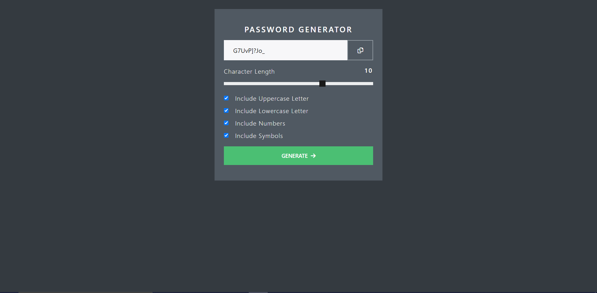
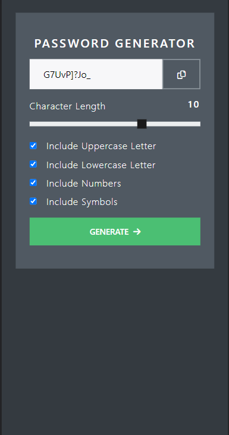

# Password Generator - React App
   Interactive Password Generator App Using React js and Bootstrap

## Table of contents

- [Password Generator - React App](#password-generator---react-app)
  - [Table of contents](#table-of-contents)
  - [Overview](#overview)
    - [The challenge](#the-challenge)
    - [Screenshot](#screenshot)
      - [Desktop Screenshot](#desktop-screenshot)
      - [Small Screen Shot](#small-screen-shot)
    - [Links](#links)
  - [My process](#my-process)
    - [Built with](#built-with)
    - [What I learned](#what-i-learned)
      - [App.js](#appjs)
  - [Author](#author)


## Overview

### The challenge

Users should be able to:

- View the optimal layout for the app depending on their device's screen size
- Select different Parameters to generate secure password
- Generate a new password by clicking button

### Screenshot

#### Desktop Screenshot 


#### Small Screen Shot 


### Links

- Live Site URL: [Live Site URL](https://warm-bubblegum-650a0f.netlify.app/)

## My process

### Built with

- HTML 5
- CSS custom properties
- Flexbox
- [Bootswatch] (https://bootswatch.com/) - Bootswatch
- [React](https://reactjs.org/) - JS library
- [generate-password] (https://www.npmjs.com/package/generate-password) - JS Library


### What I learned

 - React State
 - Using External Libraries with React

To see how you can add code snippets, see below:

#### App.js
```js
// Imported Packages
import { useState } from "react";
import Checkbox from "./component/Checkbox";
import CopyPassBtn from "./component/CopyPassBtn";
import GenerateBtn from "./component/GenerateBtn";
import PassLength from "./component/PassLength";
import {generate} from "generate-password"


function App() {
  // Password state
  const [pass, setPass] = useState('P455W0RD')
  // Copy Function
  const copyHandler = () =>{
    var copyPassword = document.getElementById("password")
    copyPassword.select()
    navigator.clipboard.writeText(copyPassword.value);
  };
  // Pass Length Slider Function
  const [passLength, setPassLength] = useState(10)
  const handleRange = () =>{
    var slider = document.getElementById("password-length");
    setPassLength(slider.value)
  }
// handle Checkbox funcationality
  // Checkbox State
  const [upper,setUpper] = useState(true)
  const [lower,setLower] = useState(true)
  const [numbers,setNumbers] = useState(true)
  const [symbols,setSymbols] = useState(true)
  const handleCheck = (e) => {
    if(e.target.name === "uppercase"){
      setUpper(current => !current)
      console.log(upper,"upper")
    }
    else if(e.target.name === "lowercase"){
      setLower(current => !current)
      console.log(lower,"Lower")
    }
    else if(e.target.name === "numbers"){
      setNumbers(current => !current)
      console.log(numbers,"Numbers")
    }
    else if(e.target.name === "symbols"){
      setSymbols(current => !current)
      console.log(symbols,"Symbols")
    }
  };
  // Password Generator Handler
  const generatePassword = () =>{
    var password = generate({
      length: passLength,
      uppercase: upper,
      lowercase: lower,
      numbers: numbers,
      symbols:symbols
    });
    setPass(password)
  }
  
  return (
    <div className="App">
      <div className="container d-flex  justify-content-center">
        <div className="col-lg-4 p-4 my-4 align-self-center" style={{background: "#505962"}}>
          <h1 className="h4 text-light text-center my-3">Password Generator</h1> 
          {/* Copy Button Component*/}
          <CopyPassBtn value = {pass} onClick = {copyHandler}/>
          {/* Password input params */}
          <div className="input-section" onChange={handleRange} >
            {/* Pass Length Slider Component */}
            <PassLength passLength = {passLength} />
            {/* Checkboxes Component */}
            <Checkbox name="uppercase" label=" Include Uppercase Letter" isChecked={upper} onChange={handleCheck}/>
            <Checkbox name="lowercase" label=" Include Lowercase Letter" isChecked={lower} onChange={handleCheck}/>
            <Checkbox name="numbers" label=" Include Numbers" isChecked={numbers} onChange={handleCheck}/>
            <Checkbox name="symbols" label=" Include Symbols" isChecked={symbols} onChange={handleCheck}/>
          </div>
          {/* Generate Button Component */}
          <GenerateBtn onClick={generatePassword} />
        </div>
      </div>
    </div>
  );
}

export default App;

```

```css

}
```

## Author
- Linkedin - [@omjiverma](https://www.linkedin.com/in/omjiverma)